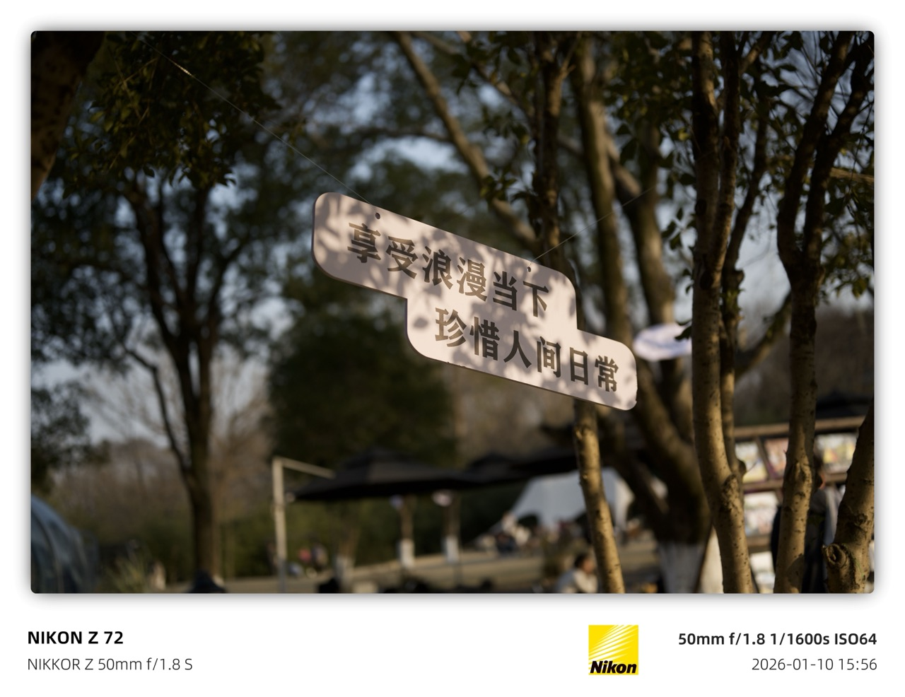
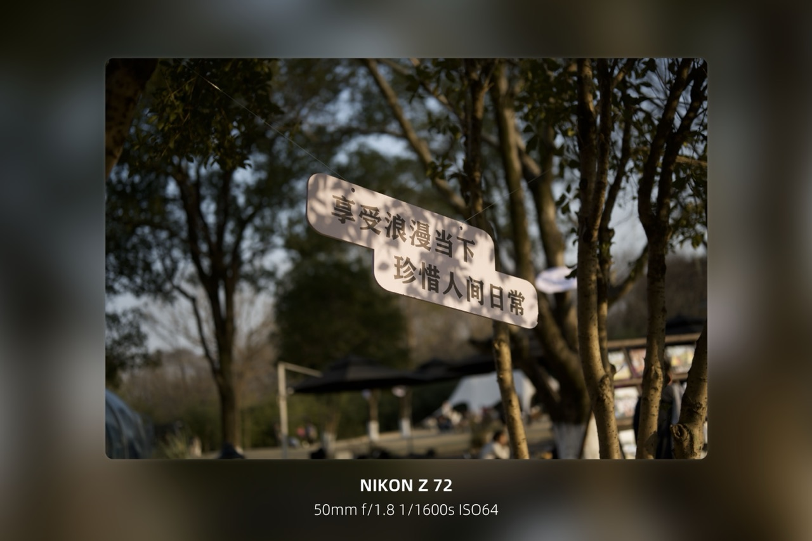
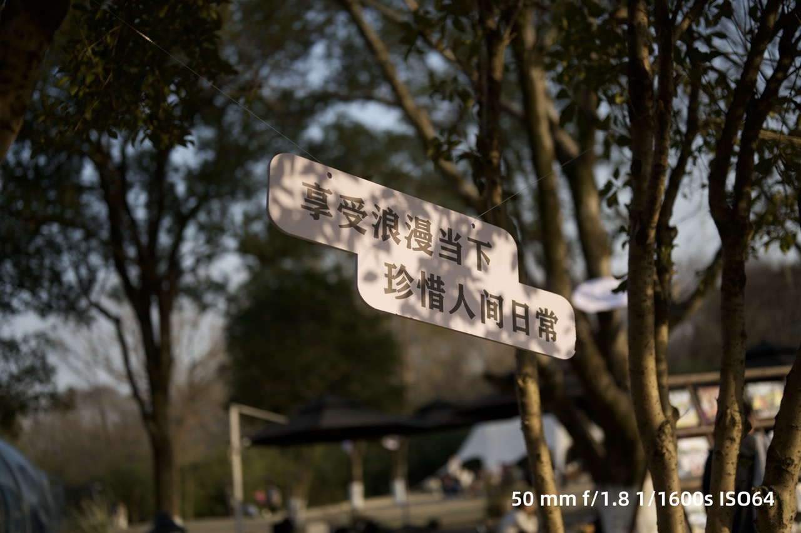
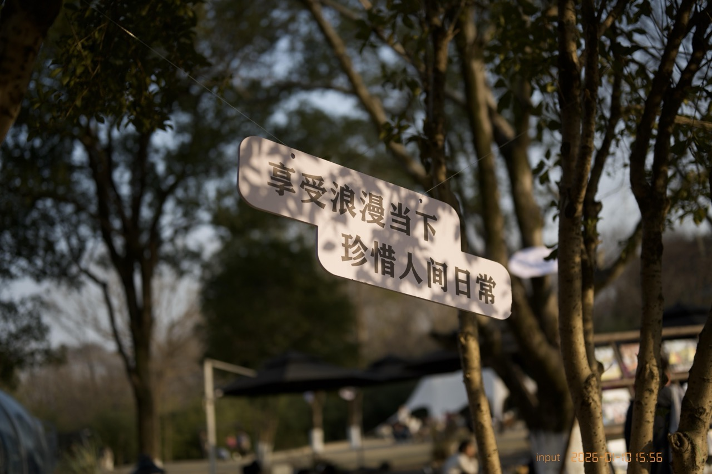
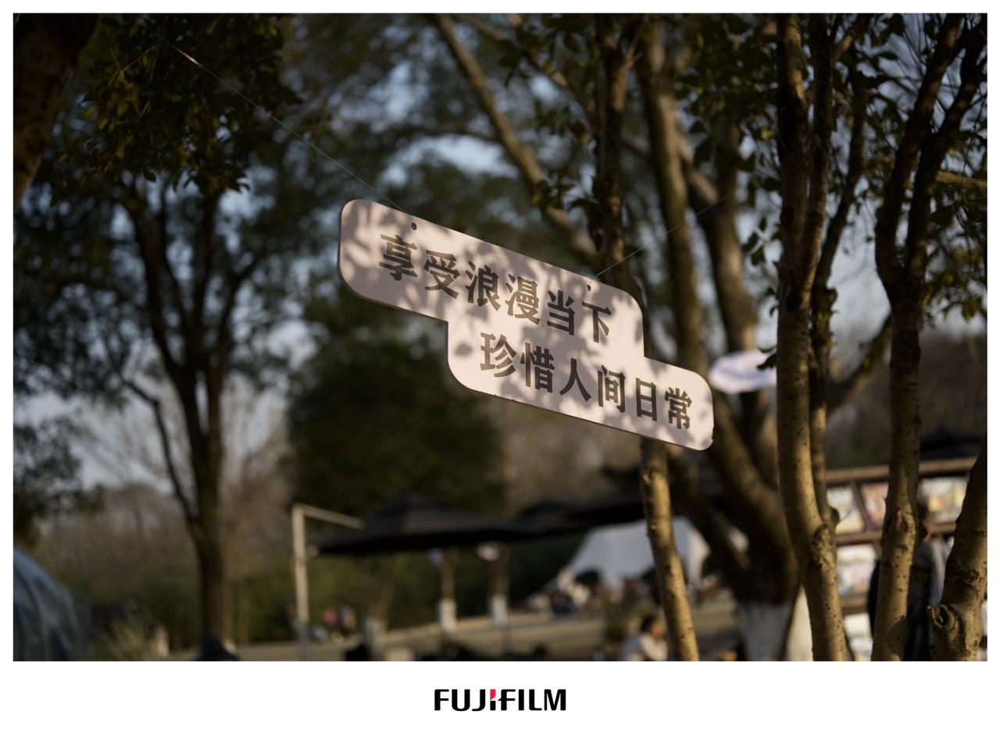

# semi-utils

> 
> 
> 
> 
> 
>
> **这是一个用于给照片批量添加水印、处理照片像素比、图像色彩和质量的工具。**

如果您觉得程序对您有所帮助的话，可以点击 [Sponsor](https:/su/cdn.lsvm.xyz/wechat.jpg) 按钮请作者喝杯咖啡，谢谢！

## 开发文档

**[Wiki](../../wiki)**

## 效果展示

| 模板                                     | 描述                                      | 效果                                      |
|----------------------------------------|-----------------------------------------|-----------------------------------------|
| [standard1](./static/standard1.json)   | 经典 EXIF 水印，包含相机型号、镜头、焦距、光圈、快门、ISO、拍摄时间和相机品牌 Logo |    |
| [standard2](./static/standard2.json)   | 在 standard1 基础上添加圆角、阴影效果和留白，适合社交媒体分享 |    |
| [nikon_blur](./static/nikon_blur.json) | 尼康风格水印，相机型号中的红色「Z」字高亮，配合模糊背景效果 |  |
| [blur](./static/blur.json)             | 简洁风格，相机型号+参数垂直居中展示，配合模糊背景效果 |              |
| [normal1](./static/normal1.json)       | 极简风格，右下角显示拍摄参数，低调不抢眼 |        |
| [normal2](./static/normal2.json)       | 文件夹名称+拍摄时间，橙色文字，简洁实用 |        |
| [center_logo](./static/center_logo.json) | 中心 Logo 水印，可自定义四周文字内容 |        |

## 许可证

Semi-Utils 的发布基于 [Apache License 2.0](LICENSE).

### exiftool

Semi-Utils 引用了 [exiftool](https://exiftool.org/)，其发布基于 [GPL v1 + Artistic License 2.0](https://exiftool.org/#license)。

## 关于

