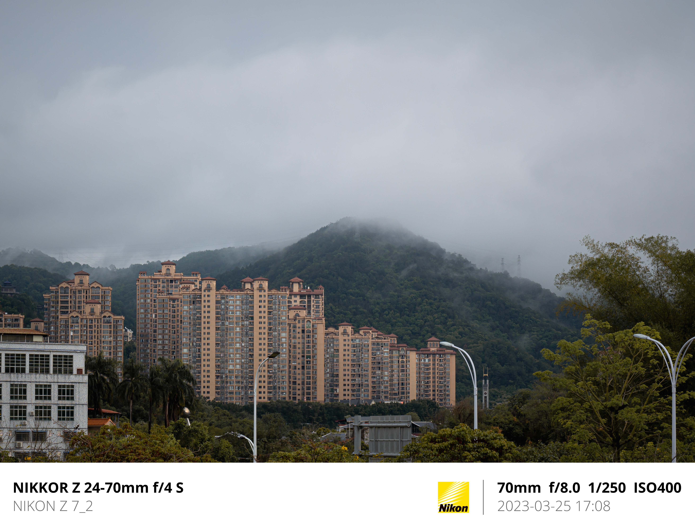
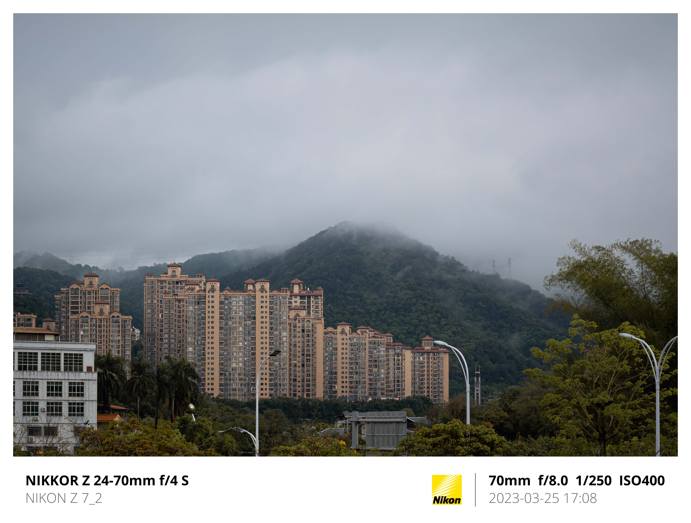
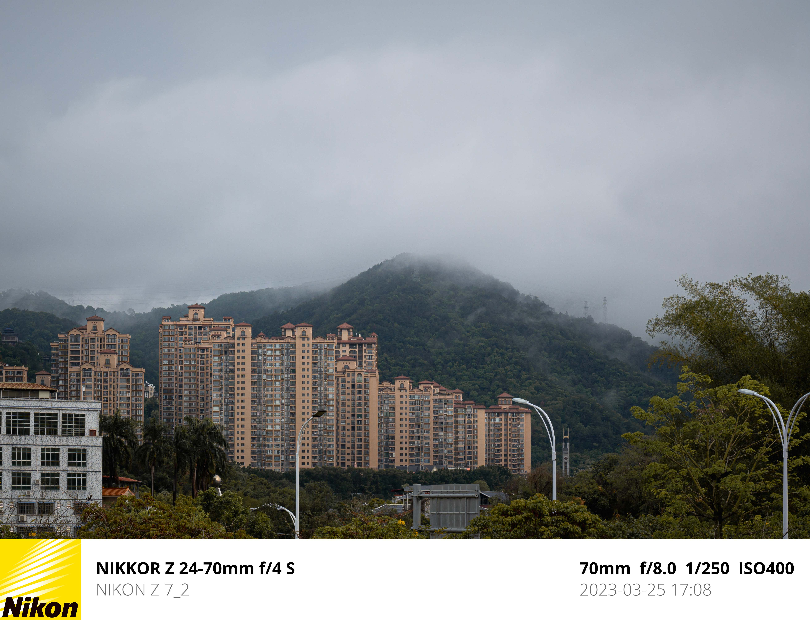
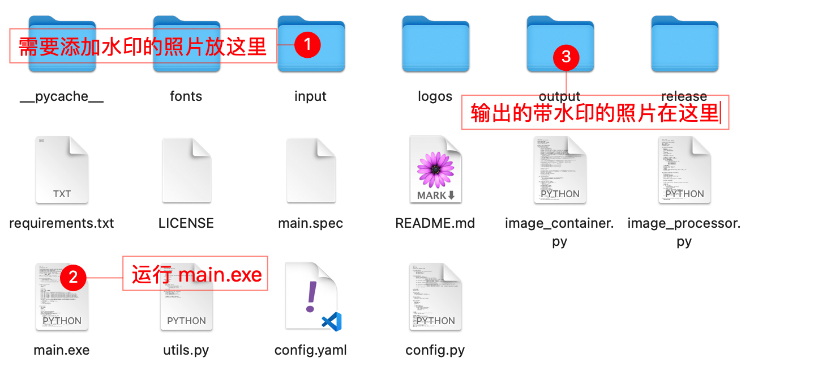

# semi-utils

> [](https://github.com/leslievan/semi-utils)
> [](https://github.com/leslievan/semi-utils/blob/master/LICENSE)
> [](https://github.com/leslievan/semi-utils/releases)
> 
>
> **这是一个用于给照片批量添加水印的工具。**

## 开发文档

**[Wiki](../../wiki)**

## 功能列表

| 功能          | 描述                                                              | 可显示/隐藏             | 可定义位置              |
|-------------|-----------------------------------------------------------------|--------------------|--------------------|
| **厂商 Logo** | 支持自动识别厂商 Logo。                                                  | :white_check_mark: | :x:                |
| **相机厂商**    | 支持自动识别相机厂商。                                                     | :white_check_mark: | :white_check_mark: |
| **相机型号**    | 支持自动识别相机型号。                                                     | :white_check_mark: | :white_check_mark: |
| **拍摄参数**    | 支持自动识别感光度、快门、光圈大小和焦距/等效焦距，如 `70mm f/8.0 1/250 IS0400`，优先读取等效焦距。 | :white_check_mark: | :white_check_mark: |
| **拍摄日期**    | 支持自动识别拍摄日期，如 `2023-03-25 17:08`。                                | :white_check_mark: | :white_check_mark: |
| **自定义文字**   | 支持自定义文字。                                                        | :white_check_mark: | :white_check_mark: |

## 效果展示

> **布局：normal_with_right**
>
> logo 居右，下方文字内容可自定义



---

> **布局：normal_with_right**
>
> logo 居右，添加外包围白框，下方文字内容可自定义



---

> **布局：normal**
>
> logo 居左，下方文字内容可自定义



---

> **布局：square**
>
> 正方形白色边框


---

>布局：简洁
>
>下方一行用于描述参数的文字


## 使用方法

> **简要步骤**
>
> 

### Windows

- 点击[Release](https://github.com/leslievan/semi-utils/releases) 可直接下载压缩包，其中包含可执行文件 `main.exe`、配置文件 `config.yaml`、输入文件夹 `input` 和输出文件夹 `output`。
- 解压压缩包，比如解压到 `D:\semi-utils`
- 将需要添加水印的图片复制到 `D:\semi-utils\input` 文件夹中
- 双击 `D:\semi-utils\main.exe` 运行程序
- 按照提示输入 `y或回车` 开始执行
- 处理好的图片存放在 `D:\semi-utils\output` 中

### macOS/Linux

- 下载源码后解压，比如解压到 `~/semi-utils`

- **安装需要的依赖（正式运行前执行一次即可）**

   打开命令行/终端，输入：

   ```shell
   cd ~/semi-utils
   chmod +x install.sh
   ./install.sh
   ```

- 将需要添加水印的图片复制到 `~/semi-utils/input` 文件夹中

- 打开命令行/终端，输入

   ```shell
   cd ~/semi-utils
   python ~/semi-utils/main.py
   ```

- 按照提示输入 `y或回车` 开始执行

- 处理好的图片存放在 `~/semi-utils/output` 中

## 高级配置

通过 `config.yaml` 配置。

| 参数                     | 描述                                 |
|------------------------|------------------------------------|
| `base.font`            | 水印字体路径，常规字重                        |
| `base.bold_font`       | 水印字体路径，加粗字重                        |
| `base.input_dir`       | 输入的原始照片，建议将原始照片复制一份到该文件夹           |
| `base.output_dir`      | 输出的带水印的照片                          |
| `base.quality`         | 输出质量，默认为 100，可以输入 60-100 之间的数字     |
| `logo.enable`          | true 或者 false，是否显示厂商 logo          |
| `logo.makes`           | 厂商 logo 列表，默认支持尼康、佳能、索尼、宾得，可自行添加配置 |
| `logo.makes.item`      | 厂商配置，一个带有 `id` 和 `path` 两个键的字典     |
| `logo.makes.item.id`   | 厂商标识，由 Exif 信息提供                   |
| `logo.makes.item.path` | 厂商 logo 路径，可自定义                    |

## 可能出现的问题

### 运行 `pip install` 时提示 `command not found`

**可能是因为没有安装 Python3**，可以通过以下几种方式安装 Python3。

1. 使用 Homebrew 安装。

   Homebrew 是 Mac 上的软件包管理器，可以轻松地安装许多应用程序和服务。

   - 如果你已经安装了 `brew`，打开终端并输入以下命令来安装 Python3：

     ```shell
     brew install python3
     ```

     如果这条命令提示 `command not found`，代表你没有安装 `brew`，跳转下一步。

    - 如果你没有安装 `brew`，打开终端并输入以下命令来安装 Homebrew：

      ```shell
      /bin/bash -c "$(curl -fsSL https://raw.githubusercontent.com/Homebrew/install/HEAD/install.sh)"
      ```

      然后输入以下命令来安装 Python3：

      ```shell
      brew install python3
      ```

2. 使用 dmg 包安装

   你可以从 [Python 官网](https://www.python.org/downloads/macos/) 下载 Python3 的安装包，选择 Stable Release 下的任一版本即可，推荐 `3.10.11`，然后打开下载好的安装包按照提示安装即可。

**验证安装**

安装完成后，可以使用以下命令来验证 Python3 是否正确安装：

```shell
python3 --version
```

此命令将返回已安装的 Python3 版本号。

## 关于

鸣谢：[JetBrains](https://jb.gg/OpenSourceSupport) 为本项目提供的开源许可

## 许可证

本项目的发布基于 [Apache License 2.0](LICENSE).

本项目引用了 [exiftool](https://exiftool.org/)，其发布基于 [GPL v1 + Artistic License 2.0](https://exiftool.org/#license)。
